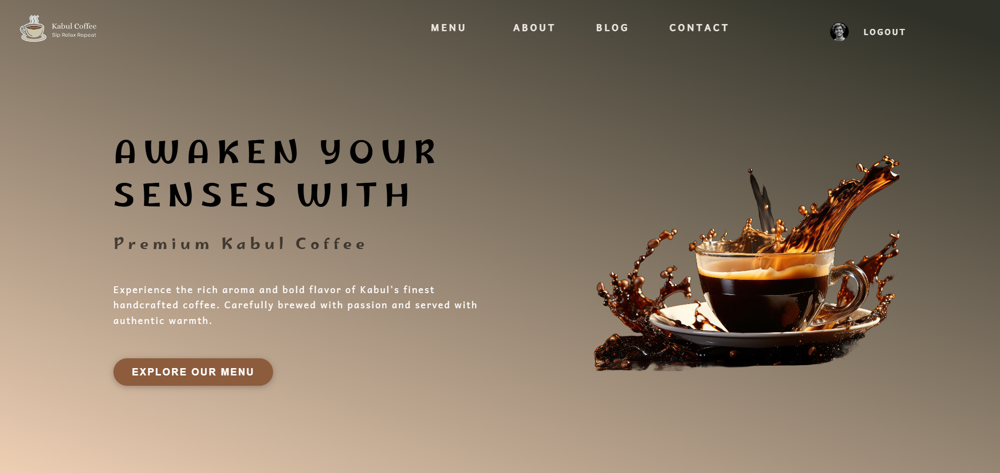
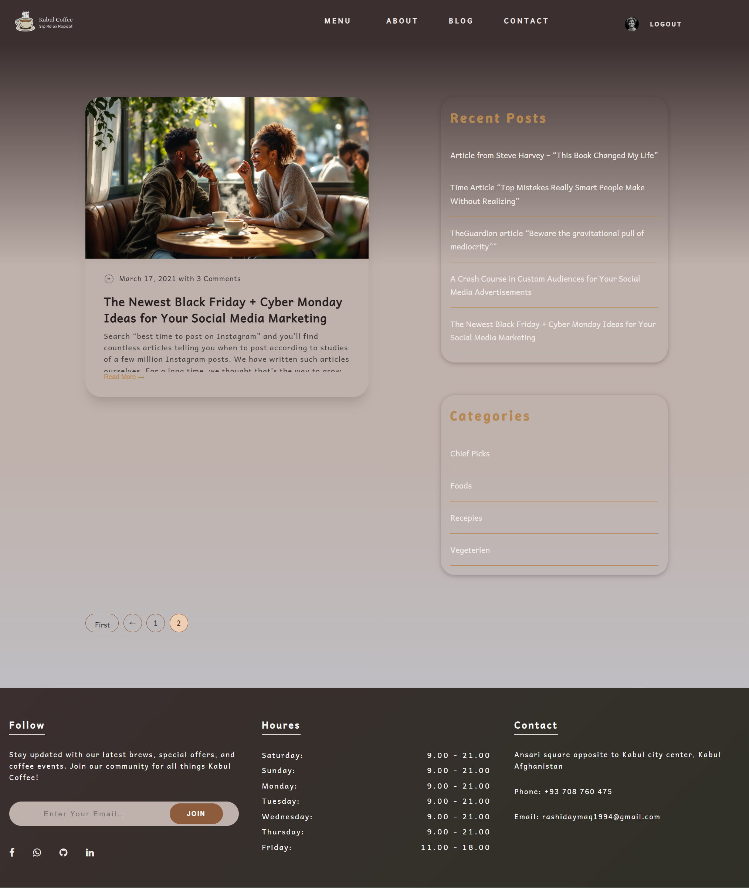
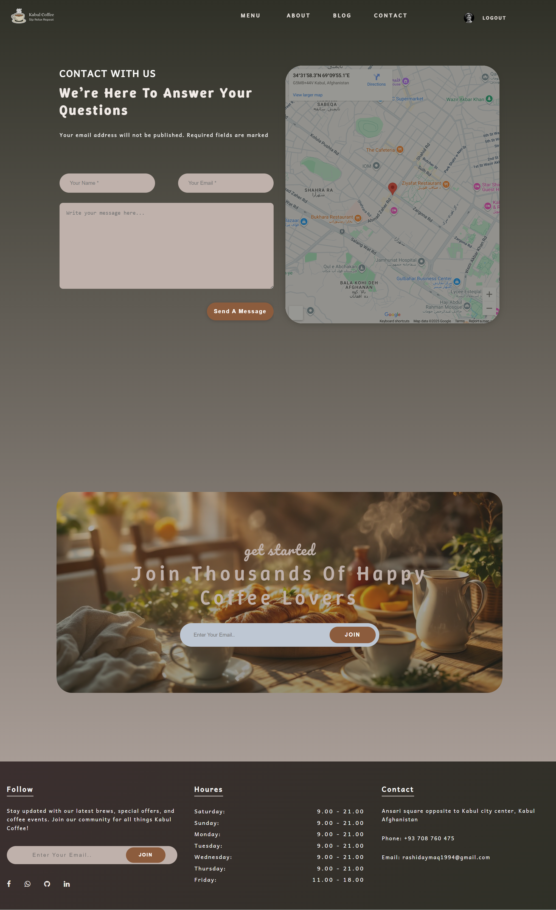
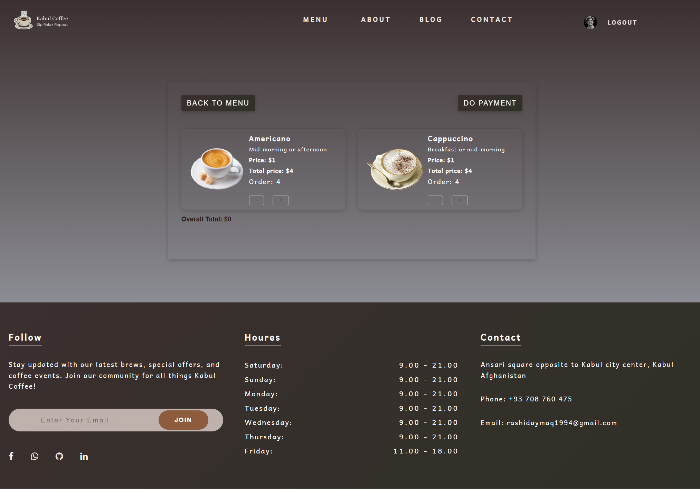
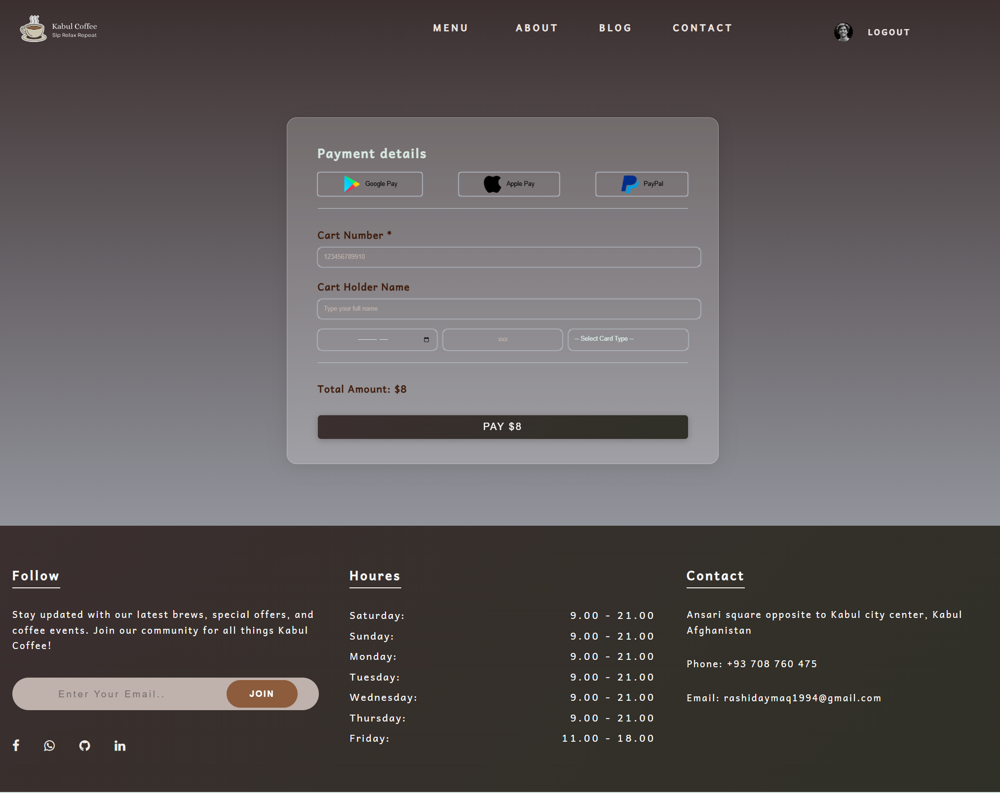
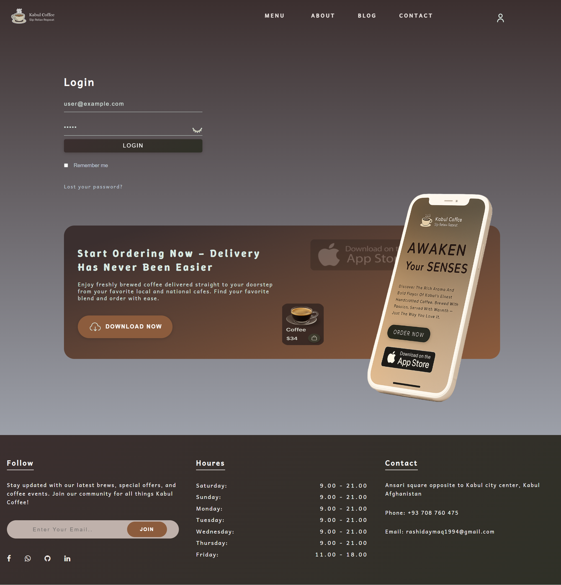

# Kabul Coffee Shop

Welcome to **Kabul Coffee**, a modern coffee shop website built with **React**. This project showcases both the physical coffee shop experience and online services including menu browsing, table reservations, and blog updates.

---

## Table of Contents

- [Project Overview](#project-overview)
- [Features](#features)
- [Technologies Used](#technologies-used)
- [Project Structure](#project-structure)
- [Project Screenshots](#project-screenshots)

---

## Project Overview

**Kabul Coffee** is designed to provide a seamless user experience for coffee lovers. Users can:

- Explore a wide variety of coffee menus.
- Reserve tables online through an easy booking system.
- Learn about the café, its team, and awards.
- Read the latest blog articles.
- Contact the café easily via the contact form or social media links.

The design emphasizes **responsive layouts**, professional typography, and visually appealing imagery for a cozy, welcoming vibe.

---

## Features

- **Menu Mega Menu**: Explore freshly brewed coffee blends and café spaces.
- **Reservation System**: Online table booking with form validation.
- **About Section**: Detailed café overview, team members, and awards.
- **Blog Page**: Display of latest coffee-related articles with images, time, and description.
- **Contact Page**: Google Maps integration, contact cards, and newsletter subscription.
- **Footer & Social Links**: Connect with Kabul Coffee on Facebook, LinkedIn, GitHub, and WhatsApp.

---

## Technologies Used

- **React** (v18+) – Component-based UI
- **React Router DOM** – Client-side routing
- **SCSS** – Styles with variables, mixins, and nesting
- **Font Awesome** – Social media icons
- **Google Maps Embed** – Display café location
- **Local Storage / Context API** – State management

---

## Project Screenshots

### 🏠 Homepage

### 📖 Menu Page

### 📅 Reservation Page

### 👥 About Page

### 📰 Blog Page

  

### 📞 Contact Page

### 🛒 Cart Page

### 💳 Payment Page

### 🔑 Login Page

---

## 🚀 Live Demo

[Kabul Coffee Shop Live](https://aymaq-code.github.io/coffee-app/)
